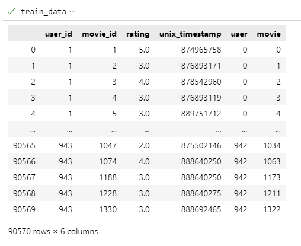
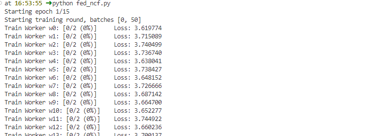
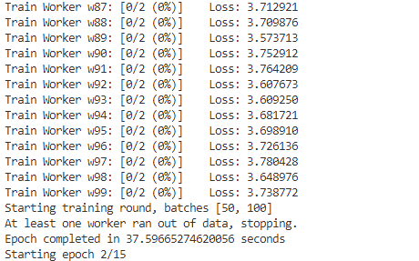
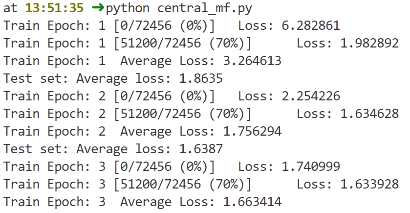
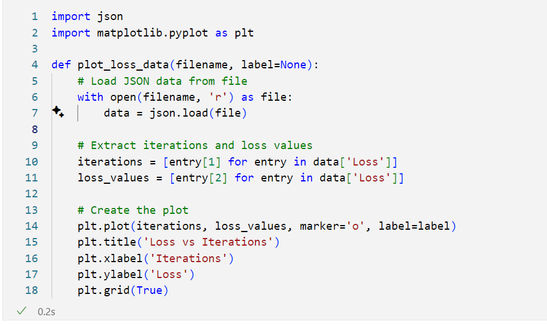
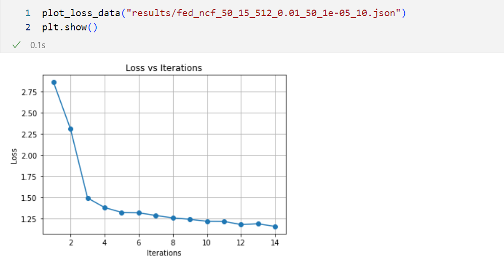

# Running the experiment

The dataset has 6 columns and 90570 items in total. The structure of the dataset is as follows:

Training process

The training process starts with creating the PySyft workers that runs the local copy of the model using their private dataset in a distributed fashion.

After finishing the one global iteration, we aggregate the local model weights into the global model and evaluate it on the held-out test set. This process continues until the desired number of epochs are reached.

For the central training process, we can `run_central\mf.py` file as shown below:

In order to plot the results we have used matplotlib package inside a Jupyter file.  

We can run the `plot_loss_data` function using the generated json results as follows:  

